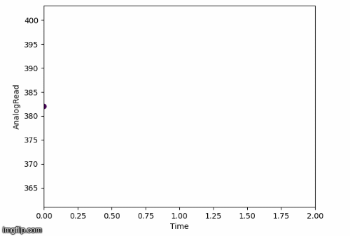
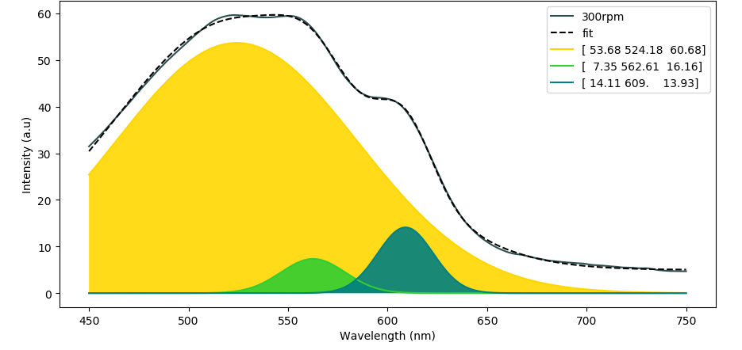

# Data Visualization
Python scripts to generate some pretty plots:

* Staggered ridgeline from *dataframe* via *AWS*  

* Scrolling x-y datalogger from *serial* via *Arduino*   
  

* Peak fit with multiple Gaussian convolution from *dataframe*  

