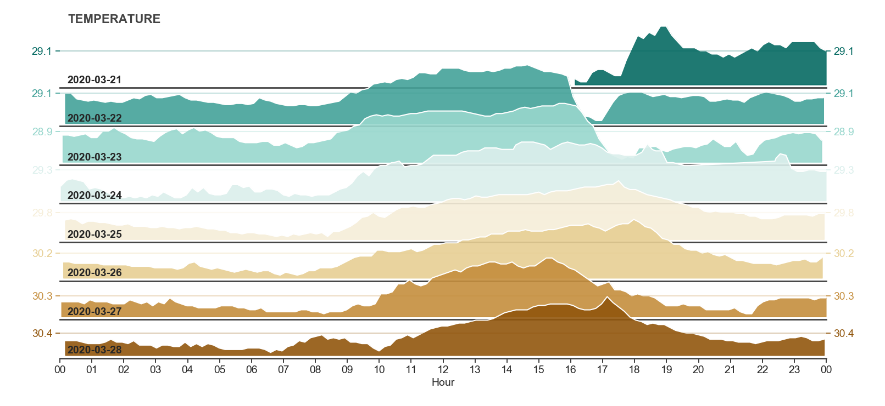
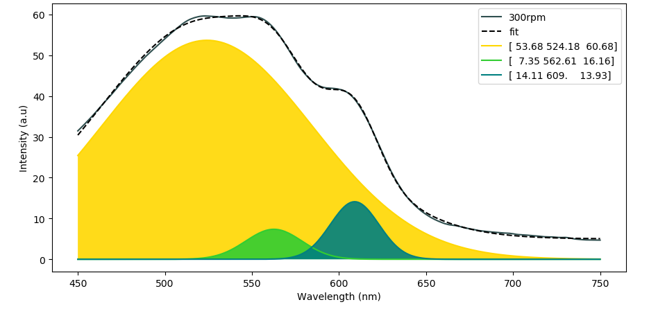

# Data Visualization
Python scripts for various types of plots:

* Staggered ridgeline from *dataframe* via *AWS*  

* Scrolling x-y datalogger from *serial* via *Arduino* __

* Peak fit with multiple Gaussian convolution from *dataframe*  

